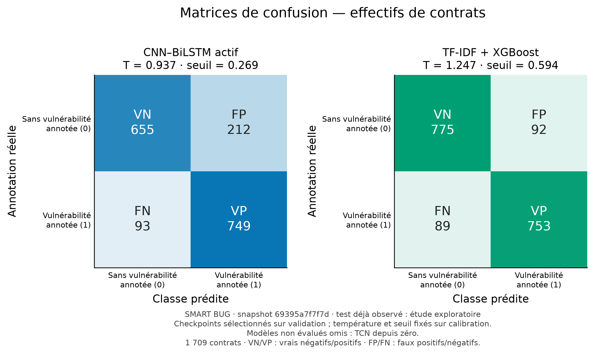

# Graphiques des modèles déjà évalués

**CNN–BiLSTM actif et TF-IDF + XGBoost**, sur les mêmes **1 709 contrats de test**. Le TCN reste en pause et n'apparaît pas dans ces graphiques. Cette comparaison partielle conserve les checkpoints sélectionnés sur validation, ainsi que les températures et seuils ajustés sur calibration.



Les lignes correspondent aux annotations réelles et les colonnes aux classes prédites. La classe 0 signifie « sans vulnérabilité annotée » ; elle ne certifie pas la sécurité. VN/VP : vrais négatifs/positifs ; FP/FN : faux positifs/négatifs.

| Graphique | PNG | SVG |
|---|---|---|
| Matrices comparées | [Ouvrir](matrices_confusion.png) | [Ouvrir](matrices_confusion.svg) |
| Matrice CNN–BiLSTM | [Ouvrir](matrice_confusion_cnn_bilstm.png) | [Ouvrir](matrice_confusion_cnn_bilstm.svg) |
| Matrice XGBoost | [Ouvrir](matrice_confusion_xgboost.png) | [Ouvrir](matrice_confusion_xgboost.svg) |
| F1, précision, rappel, FPR et PR-AUC | [Ouvrir](metriques_principales.png) | [Ouvrir](metriques_principales.svg) |
| Courbes ROC | [Ouvrir](courbe_roc.png) | [Ouvrir](courbe_roc.svg) |
| Courbes précision–rappel | [Ouvrir](courbe_precision_rappel.png) | [Ouvrir](courbe_precision_rappel.svg) |

PNG à 300 dpi ; SVG vectoriels. Les sources, empreintes, matrices et seuils exacts figurent dans [plot_manifest.json](plot_manifest.json). Les métriques ont été recalculées à partir des logits archivés et comparées aux évaluations enregistrées avant l'export. Les six PNG ont été inspectés visuellement.

Pour les régénérer depuis la racine, dans l'environnement scientifique :

```powershell
python -m src.plot_model_benchmark --available-models
```

Aucun entraînement, choix de graine ni ajustement de seuil n'est effectué par cette commande. Le mode sans cette option attend les trois évaluations pour les graphiques finaux. Le test a déjà été consulté : les comparaisons restent exploratoires.
