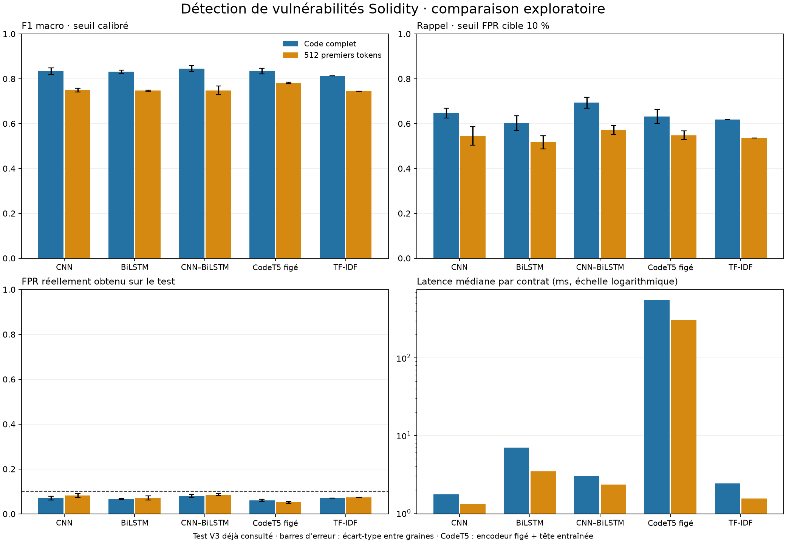

# Comparaison exploratoire des modèles

Exécution : `comparison-v1-20260922`. Variante retenue **sur validation** : **codet5_frozen_full**. Aucun remplacement automatique de V3.

## Résultats sur le test V3 déjà consulté

Moyennes sur trois graines pour les réseaux ; une seule estimation déterministe pour TF-IDF. Seuils ajustés exclusivement sur la calibration. Ces résultats ne constituent pas une confirmation sur un nouveau jeu indépendant.

| Variante | F1 macro | Rappel | Faux positifs | Rappel au seuil FPR cible 10 % | FPR réellement obtenu | ECE | Latence médiane (ms) |
|---|---:|---:|---:|---:|---:|---:|---:|
| codet5_frozen_full | 0.8340 ± 0.0126 | 0.8618 | 0.1930 | 0.6322 | 0.0604 | 0.0401 | 558.48 |
| tfidf_full | 0.8139 ± 0.0000 | 0.8420 | 0.2134 | 0.6188 | 0.0704 | 0.0800 | 2.42 |
| cnn_bilstm_full | 0.8454 ± 0.0137 | 0.8907 | 0.1984 | 0.6936 | 0.0800 | 0.0397 | 3.00 |
| cnn_full | 0.8336 ± 0.0146 | 0.8797 | 0.2107 | 0.6465 | 0.0704 | 0.0593 | 1.74 |
| bilstm_full | 0.8310 ± 0.0071 | 0.8816 | 0.2176 | 0.6025 | 0.0661 | 0.0540 | 6.97 |
| codet5_frozen_first512 | 0.7814 ± 0.0029 | 0.8662 | 0.2987 | 0.5483 | 0.0515 | 0.0486 | 310.11 |
| bilstm_first512 | 0.7468 ± 0.0028 | 0.8698 | 0.3668 | 0.5170 | 0.0715 | 0.0479 | 3.45 |
| cnn_bilstm_first512 | 0.7485 ± 0.0196 | 0.8812 | 0.3733 | 0.5713 | 0.0861 | 0.0626 | 2.33 |
| tfidf_first512 | 0.7444 ± 0.0000 | 0.8753 | 0.3760 | 0.5356 | 0.0738 | 0.0895 | 1.55 |
| cnn_first512 | 0.7496 ± 0.0087 | 0.8678 | 0.3599 | 0.5451 | 0.0823 | 0.0494 | 1.32 |

La cible de 10 % est une contrainte sur la calibration ; le FPR test peut s'en écarter. La courbe ROC test contient aussi un rappel descriptif à 10 %, enregistré dans le CSV, qui n'est pas un seuil déployable choisi sur le test.

## Ablations et incertitude

Différences gauche moins droite de F1 macro, avec intervalle bootstrap à 95 % par groupe de contrats. Ces intervalles conditionnent sur les graines exécutées ; ils ne couvrent pas toute l'incertitude d'entraînement.

| Comparaison | Différence F1 | IC 95 % |
|---|---:|---:|
| cnn_full − cnn_first512 | +0.0840 | [+0.0581, +0.1232] |
| bilstm_full − bilstm_first512 | +0.0842 | [+0.0610, +0.1205] |
| cnn_bilstm_full − cnn_bilstm_first512 | +0.0969 | [+0.0720, +0.1356] |
| codet5_frozen_full − codet5_frozen_first512 | +0.0526 | [+0.0325, +0.0814] |
| tfidf_full − tfidf_first512 | +0.0694 | [+0.0396, +0.1144] |
| cnn_bilstm_full − cnn_full | +0.0117 | [-0.0005, +0.0265] |
| cnn_bilstm_full − bilstm_full | +0.0143 | [+0.0020, +0.0293] |
| codet5_frozen_full − cnn_bilstm_full | -0.0114 | [-0.0269, +0.0026] |
| codet5_frozen_full − tfidf_full | +0.0201 | [-0.0017, +0.0459] |

## Protocole et limites

- Test : 1709 contrats ; 386 présentent un préfixe de 512 tokens identique à celui d'un exemple d'entraînement, validation ou calibration. Les scores du sous-ensemble commun sans ces collisions figurent dans `summary.csv` et chaque `evaluation.json`.
- Les partitions, le vocabulaire et les poids d'échantillons proviennent de V3. Le vocabulaire et les scalers sont ajustés sur l'entraînement uniquement. Tous les contrats de la partition train sont vus à chaque époque.
- CNN, BiLSTM et CNN-BiLSTM sont entraînés de zéro sous PyTorch, avec embeddings 32, fenêtres CNN 256, filtres 24, noyau 5, unités LSTM 24 par direction, dense 32, dropout 0.3, Adam lr 0.001, maximum 12 époques, arrêt anticipé 3 sur log-loss validation, gradient clip 1.0. Batches ≤ 32 contrats et budget 65536 positions remplies, sauf contrat individuel plus long.
- CNN : convolution par fenêtre, moyenne/max par fenêtre puis sur toutes les fenêtres. BiLSTM : récurrence bidirectionnelle sur tous les tokens. CNN-BiLSTM : récurrence sur les représentations des fenêtres CNN. Les variantes complètes conservent tous les tokens ; les variantes tronquées gardent 512 tokens lexicaux avant encodage sans perte.
- CodeT5-small : encodeur préentraîné figé, sans fine-tuning ; tous les sous-tokens sont répartis en fenêtres de 256 positions spéciales incluses. Moyenne pondérée et maximum global des états, standardisation sur train, tête dense entraînée. La normalisation des identifiants V3 diffère du code naturel vu au préentraînement. Ce résultat ne mesure donc pas le potentiel d'un CodeT5 finement ajusté au Solidity.
- TF-IDF 1–2 grammes, 20 000 caractéristiques maximum, min_df=2, TF sous-linéaire et régression logistique C=1, liblinear. C'est une référence classique ; les réseaux ne sont pas présumés meilleurs.
- Budget comparable en passages sur les données et hyperparamètres communs, pas en FLOPs ni temps mural. Les architectures ont des nombres de paramètres différents. Les trois graines CodeT5 ne réentraînent que la tête.
- Température et deux seuils appris sur calibration : rappel cible 90 %, et FPR cible 10 %. Le choix de variante privilégie le rappel sur la ROC validation à FPR ≤ 10 %, puis F1 macro et log-loss validation.
- La latence inclut l'encodage propre à chaque modèle et, pour CodeT5, l'encodeur préentraîné. Elle exclut chargement des poids, disque et normalisation Solidity commune. Mesure séquentielle sur les mêmes contrats de validation, après échauffement.
- Labels issus des sources historiques, parfois faibles ; le holdout de source contient seulement six négatifs. Ses taux de faux positifs sont très incertains. Les sous-groupes et matrices de confusion sont disponibles dans les JSON.
- Une évaluation finale sur des contrats indépendants, avec labels vérifiés et séparation par familles/projets, reste nécessaire avant d'affirmer une supériorité générale ou de modifier le modèle actif.

## Fichiers reproductibles

- `config/comparison_v1.json` : hyperparamètres et décisions avant entraînement.
- `src/compare_models.py` : entraînements, sélection, checkpoints et historiques.
- `src/comparison_pretrained.py` : téléchargement à révision figée et extraction complète des représentations CodeT5.
- `src/evaluate_comparison.py` : calibration, test, latences et rapport.
- `protocol.json`, `selection.json`, `summary.csv`, `paired_comparisons.json` : provenance et résultats détaillés.

## Interprétation des temps

Les durées d'entraînement sont des temps muraux, qui incluent les pauses et la suspension éventuelle de la machine. Une longue interruption a été observée pendant l'exécution ; ces totaux ne mesurent donc pas seuls l'efficacité des architectures. Le CSV fournit aussi les durées médiane et maximale par époque et signale les pauses supérieures à cinq fois la médiane. Les latences sont mesurées séparément après l'entraînement.

Pour CodeT5, le temps d'entraînement de la tête exclut l'extraction préalable de l'encodeur : les durées d'extraction par partition sont conservées dans `pretrained_extraction.json`. Les entrées complètes et tronquées partagent les fenêtres identiques pendant cette extraction ; ce coût partagé ne peut pas être attribué séparément à chaque variante.

